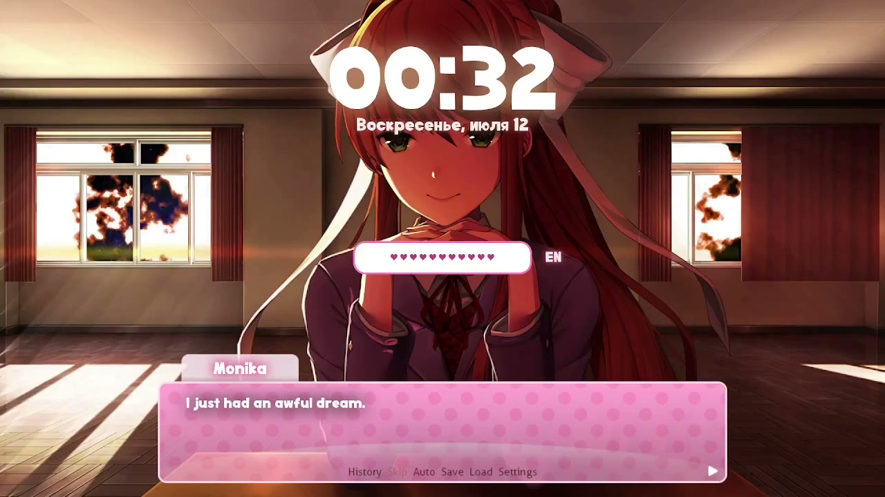

<div align="center">

# ddlc-hyprlock

**Локскрин в стиле Doki Doki Literature Club: Act 3** (｡•̀ᴗ-)✧


[](https://github.com/rokokol/ddlc-palette)
[](ASSETS.md)
[](LICENSE)
[](https://github.com/rokokol/ddlc-hyprlock/actions/workflows/build.yml)

[English](README.md)

</div>

Все цвета — измеренные, из [ddlc-palette](https://github.com/rokokol/ddlc-palette), которая читает их с [ddlc.moe](https://ddlc.moe). Ничего не подобрано на глаз

> [!NOTE]
> Не связано с Team Salvato и не одобрено ими. Диалоговый бокс, фон и все реплики — их, см. [ASSETS.md](ASSETS.md)

Приехало из моего райса, **[rokokol/huix](https://github.com/rokokol/huix)**

```sh
# отрендерить конфиг и почитать его, ничего не устанавливая
nix build github:rokokol/ddlc-hyprlock && cat result/share/ddlc-hyprlock/hyprlock.conf
```

## Содержание

- [UI](#ui)
  - [Как выглядит](#как-выглядит)
  - [Как устроен диалог](#как-устроен-диалог)
  - [Глитчи](#глитчи)
  - [Её собственные слова](#её-собственные-слова)
- [Установка](#установка)
  - [Home Manager](#home-manager)
  - [Любой другой дистрибутив](#любой-другой-дистрибутив)
  - [Шрифта здесь нет](#шрифта-здесь-нет)
- [Как запускается лок](#как-запускается-лок)
- [Тесты](#тесты)
- [Раскладка](#раскладка)
- [Лицензия](#лицензия)

## UI

### Как выглядит



Реплика печатается по буквам, переносится внутри бокса, если не влезает, и ломается, когда срабатывает глитч — всё втроём за девять секунд:


Неверный пароль — это глитч с поводом: плашка и строка разъезжаются, а поле так и говорит


> Дата — это `date +"%A, %B %-d"`, то есть выходит в той локали, в которой запущена сессия; на этих кадрах — по-русски

### Как устроен диалог

Бокс — статичная картинка, а текст — два лейбла поверх неё. Движок рендерит кадр и пишет его в `stateDir`: `frame` для строки, `name` для плашки, — а лейблы в конфиге объявлены как `cmd[update:100] cat` ровно по этим двум файлам, так что hyprlock подхватывает кадр на собственном поллинге. Перезапись в обе стороны, а не сигнал, потому что обработчик `SIGUSR2` в hyprlock ходит по вектору таймеров без мьютекса и аллоцирует внутри обработчика: пуш в занятый локер его вешает ([hyprwm/hyprlock#539](https://github.com/hyprwm/hyprlock/pull/539))

Печать — приём Ren'Py: каждый кадр рендерит **всю** реплику, а ещё не напечатанный хвост спрятан в прозрачном span. Но это только половина неподвижности: у лейбла hyprlock нет ни ширины, ни угла, за который можно прицепиться, — он ставится по собственной текстуре. Поэтому кадр добит со всех сторон, которые могли бы поехать: пустыми строками до высоты текстовой области и закрывающей строкой пробелов, заведомо шире любой реплики. При постоянном размере текстуры `halign = center` плюс `valign = bottom` держат левый верхний угол текста в отбивке бокса, и строка растёт вправо, а не расползается из середины. Всему этому нужен `text_trim = false`, поэтому он в конфиге и стоит

Геометрия считается в [`nix/config.nix`](nix/config.nix) от собственного холста бокса 1280x720, и ширина, которую она отдала текстовой области, уезжает в движок: перенос обязан быть тем же числом, по которому раскладывались лейблы. Свой `dialogImage` должен сохранять этот холст

### Глитчи

Один механизм на два повода: неверный пароль и пуассоновский поток спонтанных срабатываний. Оба ломают имя и текст мусорными глифами и оба глитчат весь экран — на время короче, чем держится поломанный текст. Неверный пароль приходит строкой от follower'а `journalctl -f`, на котором цикл же и спит: журнал не опрашивается, а реакция мгновенная. `glitch = false` убирает и follower, и поток — диалог всё ещё печатает, просто никогда не ломается

Флеш — работа композитора, а не hyprlock, и `flash` выбирает, кто его делает:

| `flash` | | |
| --- | --- | --- |
| `hyprctl` | ставит в `decoration:screen_shader` шейдер [`shaders/glitch.frag`](shaders/glitch.frag) из комплекта и убирает его, когда флеш кончился | не нужно ничего, кроме Hyprland, но эта опция целиком **его**: что бы там ни лежало, после первого глитча этого там нет |
| `screen-shader` | отдаёт флеш [screen-shader](https://github.com/rokokol/hyprland-screen-shader), который композитит его поверх уже активного эффекта и возвращает всё как было | достаточно задать пакет в `screenShader` — он сам выбирает этот режим |
| `none` | ничего, глитч остаётся только текстовым | |

В обоих случаях гасит флеш сам движок, по своим часам, в том же цикле, что рендерит кадры: никакого фонового спальщика, который переживёт лок, и убитый посреди флеша лок уносит шейдер с собой

### Её собственные слова

`quotesFile` и `reentryFile` — обычный текст: блоки разделены пустой строкой, одна реплика на строку, `#` — комментарий. Лок открывается блоком из `reentryFile` — она замечает, что ты вернулся, — а дальше тянет из `quotesFile`, никогда один блок два раза подряд. В комплекте её реплики из третьего акта, дословно

В строке подставляются две вещи, и обе — то, что она говорит про машину, на которой живёт:

- `[player]` — `$USER`, имя, которым она тебя зовёт
- `[chr]` — `characterFile`, путь, который она называет, когда говорит про свой файл персонажа. Его никто не создаёт и никто не читает: это реплика, а не файл, и по умолчанию это `$XDG_DATA_HOME/ddlc-hyprlock/<name>.chr`

## Установка

### Home Manager

```nix
{
  inputs.ddlc-hyprlock.url = "github:rokokol/ddlc-hyprlock";

  # в домашней конфигурации
  imports = [ inputs.ddlc-hyprlock.homeManagerModules.default ];

  ddlc.hyprlock.enable = true;
}
```

Это включает `programs.hyprlock`, пишет весь конфиг и ставит движок диалога. Само оно ничего не запускает — см. [как запускается лок](#как-запускается-лок)

| опция | | по умолчанию |
| --- | --- | --- |
| `dialog` | бокс, печатающиеся реплики и плашка с именем. Выключенным остаётся фон, часы, дата, раскладка и поле ввода | `true` |
| `glitch` | ломать диалог на неверный пароль и в случайные моменты | как `dialog` |
| `flash` | чем глитчить весь экран: `hyprctl`, `screen-shader` или `none` | `screen-shader`, если задан `screenShader`, иначе `hyprctl` |
| `screenShader` | пакет [screen-shader](https://github.com/rokokol/hyprland-screen-shader) — для этого режима | `null` |
| `glitchShader` | шейдер, который ставит режим `hyprctl`: полный шейдер экрана Hyprland, а не тело эффекта | из комплекта |
| `name` | имя на плашке | `Monika` |
| `characterFile` | во что превращается `[chr]` в реплике | `$XDG_DATA_HOME/ddlc-hyprlock/<name>.chr` |
| `font` | шрифт всех лейблов и поля ввода | `Doki` |
| `background` | фон под локом | из комплекта |
| `dialogImage` | сам диалоговый бокс | из комплекта |
| `quotesFile` | о чём она говорит | реплики третьего акта из комплекта |
| `reentryFile` | реплики, с которых открывается лок | из комплекта |
| `placeholderText` | что написано в пустом поле пароля | `<i>Give me it...~</i>` |
| `failText` | что говорит неверный пароль | `This isn't it... ($ATTEMPTS)` |
| `stateDir` | каталог, через который передаётся отрендеренный кадр: движок пишет туда `frame` и `name`, лейблы их `cat`'ают | `${XDG_RUNTIME_DIR:-/tmp}/hypr-ddlc` |
| `pollMs` | как часто hyprlock перечитывает этот кадр, мс. Это же и частота кадров движка, и один символ печати, а каждый тик стоит шелла — это пол, а не ручка | `100` |
| `lockCommand` | только для чтения, и единственное, что надо потребить: ровно та команда, которой берётся лок | движок, а без `dialog` — чистый hyprlock |

### Любой другой дистрибутив

```sh
git clone https://github.com/rokokol/ddlc-hyprlock
cd ddlc-hyprlock
sudo ./install.sh          # PREFIX=~/.local ./install.sh для установки в юзера
```

Ничего не собирается: [`dist/`](dist) — это отрендеренный конфиг, закоммиченный, а `install.sh` только подставляет в него, куда легли ассеты. Дальше забрать конфиг и запускать лок через движок:

```sh
cp /usr/local/share/ddlc-hyprlock/hyprlock.conf ~/.config/hypr/hyprlock.conf
ddlc-hyprlock lock
```

Ассеты, реплики и шейдер движок находит от собственного расположения, задавать ничего не нужно. Всё, что он всё-таки читает, описано в `ddlc-hyprlock help`

> [!NOTE]
> bash 5.2 или новее. Кадр рендерится на чистом bash — без форка на символ, — и от версии зависят и `EPOCHREALTIME`, и экранирование pango

### Шрифта здесь нет

Конфиг просит **Doki**, шрифт из игры, и он не в комплекте: теме не место в установке шрифтов, да и этот ещё и копирайтный. Ставь в `font` то, что есть, либо поставь Doki сам и не трогай опцию. Геометрия от шрифта не зависит: текст закреплён размером текстуры, а не метриками шрифта

## Как запускается лок

`ddlc-hyprlock lock` стартует hyprlock своим потомком и анимирует диалог, пока локер не выйдет. Он никогда не убивает hyprlock, поэтому смерть движка не может разлочить экран, и блокируется ровно на время лока — именно это нужно демону простоя от команды лока. `lockCommand` и есть эта команда, выписанная для того, кому она нужна:

```nix
services.hypridle.settings.general.lock_cmd = "pidof hyprlock || ${config.ddlc.hyprlock.lockCommand}";
```

Она read-only потому, что выводится, а не выбирается: с выключенным `dialog` это чистый hyprlock и запускать нечего, так что заданная руками она могла бы только разъехаться с тем, что установлено

Бинду звать её напрямую не надо — идти через сессию, чтобы все пути к локу были одним путём:

```conf
bind = SUPER, F12, exec, loginctl lock-session
```

## Тесты

```sh
tests/run.sh            # движок против заглушек локера, журнала, hyprctl и screen-shader
tests/run.sh --update   # перезаписать голдены
```

Набор гоняет упакованную команду, а не скрипт: половина того, что тут можно сломать, — это дефолты враппера. И изолирует `HOME`, `XDG_RUNTIME_DIR` и `XDG_DATA_HOME` — последние два экспортирует сессия, иначе движок публиковал бы кадры в state-каталог живого лока. А ещё он отказывается запускаться, пока каждая заглушка не исполняемая и не первая в `PATH`: заглушка, которая не то и не другое, молча отдаёт тесту настоящий инструмент, а для `hyprctl` это живой композитор вместо лог-файла

`nix flake check` добавляет к этому: `dist/` — то, что отрендерил бы пакет; в упакованном конфиге не осталось плейсхолдера и он читает state-файлы; модуль Home Manager вычисляется против заглушек опций — и с диалогом, и без, потому что чистый лок обязан быть по-настоящему чистым, и с флешем, за которым нет ни композитора, ни пакета, потому что это предупреждение и ошибка соответственно

## Раскладка

```
nix/config.nix       весь локскрин как данные: геометрия, цвета, лейблы
nix/render.nix       этот attrset -> hyprlock.conf, для тех, кого Home Manager не обслужит
nix/                 package.nix, module.nix, module-test.nix
ddlc-hyprlock.sh     движок диалога
assets/              фон, диалоговый бокс и то, что она говорит
shaders/glitch.frag  флеш для режима, которому не нужны зависимости
dist/                отрендеренный конфиг, закоммичен для тех, у кого нет Nix
tests/run.sh         набор движка, с заглушками и голденами
install.sh           для систем без Nix
```

## Лицензия

Doki Doki Literature Club сделана [Team Salvato](https://teamsalvato.com/). Это некоммерческий фанатский контент, и что представляет собой каждый файл из комплекта — в [ASSETS.md](ASSETS.md). Код под MIT
